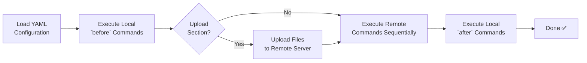

# 🚀 Orbit


Orbit is a CLI application that simplifies remote server workflows by combining SSH access, file transfers, and local/remote command execution into configurable, reusable projects.

Built with **Go (Golang)** and powered by **Cobra CLI** for a fast, scalable, and maintainable command-line experience.

## ✨ Features

- 🔐 **Connect to remote servers via SSH**:
  - Username & password
  - SSH alias (from SSH config)
  - Private key with passphrase
- ⚡ Execute commands remotely
- 📦 Upload files to remote servers (optional)
- 🛠 Run local commands before and after remote execution
- 📂 Support for running local commands in custom directories
- 🧩 Create reusable projects
- 💾 Persistent configuration using YAML
- 🔄 **Automate workflows** like: Build locally → (optional upload) → deploy remotely

## 📌 Table of Contents

- [Quick Start](#quick-start)
- [Requirements](#requirements)
- [Project Structure](#project-structure)
- [Configuration](#configuration)
- [SSH Alias Guide](#ssh-alias-guide)
- [Examples](#examples)
- [Command Reference](#command-reference)
- [How It Works](#how-it-works)
- [Security](#security)
- [Troubleshooting](#troubleshooting)
- [Roadmap](#roadmap)
- [Contributing](#contributing)
- [License](#license)

---

## ⚡ Quick Start

```bash
# install from source
go install github.com/cristiangonsevi/orbit@latest

# or install from a release script
curl -fsSL https://raw.githubusercontent.com/cristiangonsevi/orbit/main/scripts/install.sh | sh

# ensure Go bin is in PATH
export PATH="$HOME/.local/bin:$PATH"

# initialize config (creates a YAML template)
orbit init

# run your first project
orbit run my-app
```

**📍 Binary location:**

```
~/.local/bin/orbit
```

**📍 Config file location:**

```
~/.config/orbit/config.yaml
```

---

## 📁 Requirements

- Go 1.25+ installed
- SSH access to remote hosts
- `~/.local/bin` added to your PATH
- Optional: SSH config with aliases defined in `~/.ssh/config`

---

## 📁 Project Structure

The project follows a clean and scalable structure using Cobra commands:

```
.
├── cmd/                # CLI commands (Cobra)
│   ├── root.go
│   ├── run.go
│   └── list.go
├── internal/           # Core application logic
│   ├── ssh/            # SSH connection & execution
│   ├── config/         # YAML parsing & persistence
│   ├── executor/       # Workflow orchestration
│   └── uploader/       # File transfer logic
├── scripts/            # Build and install helpers
├── pkg/                # Reusable public packages (optional)
├── configs/            # Example or default configs
├── main.go             # Entry point
└── README.md
```

> **Note:** Some directories (e.g., `internal/`, `pkg/`) represent the intended architecture and may be populated incrementally as the project evolves.

---

## 📦 Build and Install

Orbit includes helper scripts similar to the PortBridge project:

```bash
# build release artifacts for linux/darwin amd64/arm64
./scripts/build_all.sh

# build a single target
GOOS=linux GOARCH=amd64 ./scripts/build_all.sh

# install the latest GitHub release into /usr/local/bin
./scripts/install.sh

# install into a custom prefix
./scripts/install.sh --prefix ~/.local/bin
```

The build script produces release-style binaries and `.tar.gz` archives in `build/`. The install script downloads the matching archive for your platform and falls back to the direct binary when needed.

---

## 📁 Configuration

Projects are stored in YAML format and allow you to define full workflows.

> **Note:** The `upload` section is optional. If omitted, the workflow will skip file transfer and only execute local and remote commands.

> **Note:** Remote commands are executed sequentially in the same shell session, so context is preserved. If you run `cd /folder` and then `ls`, the `ls` command runs inside `/folder`.

> **Note:** Local commands run in the current working directory by default. Use `working_dir` to change it.

### YAML structure

```yaml
projects:
  project-name:
    ssh:
      host: example.com        # required unless using ssh alias
      user: deployer
      auth:
        type: key              # key, password
        key_path: ~/.ssh/id_rsa
        passphrase: secret
        # password: secret      # only for password auth
    local:
      working_dir: ./app
      before:
        - npm install
        - npm run build
      after:
        - echo "Done"
    upload:
      - source: ./app/dist
        destination: /srv/www/app
    remote:
      commands:
        - cd /srv/www/app
        - npm ci --omit=dev
        - sudo systemctl restart app.service
```

### Fields

- `projects`: top-level map of project definitions
- `ssh.host`: remote host or omit when using `ssh.alias`
- `ssh.alias`: SSH config alias from `~/.ssh/config`
- `ssh.user`: remote SSH user
- `ssh.auth.type`: `key` or `password`
- `ssh.auth.key_path`: path to private key (only for key auth)
- `ssh.auth.passphrase`: passphrase for the private key
- `ssh.auth.password`: password-based SSH auth
- `local.working_dir`: local directory for `before`/`after` commands
- `local.before`: commands executed before upload/remote steps
- `local.after`: commands executed after remote steps
- `upload`: optional array of files/directories to send
- `remote.commands`: sequential commands executed on the remote host

The default configuration lives at:

```bash
~/.config/orbit/config.yaml
```

---

## SSH Alias Guide

If you use an SSH alias, define it in `~/.ssh/config`:

```text
Host backend-prod-alias
  HostName example.com
  User produser
  IdentityFile ~/.ssh/id_ed25519
```

Then the project can omit `host` and `key_path`:

```yaml
ssh:
  alias: backend-prod-alias
  user: produser
  auth:
    type: key
    passphrase: supersecurepass
```

---

## Examples

### Minimal project (no upload)

```yaml
projects:
  simple-app:
    ssh:
      host: example.com
      user: deployer
      auth:
        type: key
        key_path: ~/.ssh/id_rsa
        passphrase: example-passphrase
    local:
      before:
        - echo "Starting deployment"
    remote:
      commands:
        - cd /srv/simple-app
        - ls
        - sudo systemctl restart simple-app.service
```

### Realistic Node.js deploy with upload

```yaml
projects:
  my-webapp:
    ssh:
      host: 192.168.1.100
      user: deployer
      auth:
        type: key
        key_path: ~/.ssh/id_rsa
        passphrase: my-secret-passphrase
    local:
      working_dir: ./webapp
      before:
        - echo "Building frontend..."
        - npm ci
        - npm run build
      after:
        - echo "Local build complete."
    upload:
      - source: ./webapp/dist
        destination: /srv/www/webapp
    remote:
      commands:
        - cd /srv/www/webapp
        - echo "Installing dependencies..."
        - npm ci --omit=dev
        - echo "Restarting service..."
        - sudo systemctl restart webapp.service
```

### Deploy using SSH alias and passphrase

```yaml
projects:
  prod-backend:
    ssh:
      alias: backend-prod-alias
      user: produser
      auth:
        type: key
        passphrase: supersecurepass
    local:
      working_dir: ./backend
      before:
        - echo "Running Go build..."
        - go build -o backend-app .
      after:
        - echo "Local build done."
    upload:
      - source: ./backend/backend-app
        destination: /opt/backend/backend-app
    remote:
      commands:
        - chmod +x /opt/backend/backend-app
        - sudo systemctl restart backend.service
```

### Deploy using username and password

```yaml
projects:
  staging-api:
    ssh:
      host: staging.example.com
      user: apiuser
      auth:
        type: password
        password: mypassword123
    local:
      working_dir: ./api
      before:
        - echo "Running tests..."
        - pytest
        - echo "Packaging app..."
        - tar czf api.tar.gz .
      after:
        - rm api.tar.gz
    upload:
      - source: ./api/api.tar.gz
        destination: /tmp/api.tar.gz
    remote:
      commands:
        - tar xzf /tmp/api.tar.gz -C /srv/api
        - sudo systemctl restart api.service
```

---

## Command Reference

### Available commands

- `orbit init`
- `orbit list`
- `orbit run <project-name>`
- `orbit run <project-name> --dry-run`
- `orbit version`
- `orbit --help`
- `orbit --version`

### `orbit init`

Initialize a new configuration file and create a starter YAML template.
- Creates `~/.config/orbit/config.yaml` by default.
- Use this command before running your first project.

### `orbit list`

Lists all project names defined in the config file and shows the remote user/host for each one.

### `orbit run <project-name>`

Runs the project workflow in order: local before commands, remote connection, uploads, remote commands, and local after commands.

### `orbit version`

Prints the current CLI version.

---

## 🛠️ Release Flow

When you create a release, build the artifacts first and attach the generated archives to GitHub Releases:

```bash
VERSION=v0.2.0 ./scripts/build_all.sh --clean
```

Then publish the matching `orbit-<os>-<arch>.tar.gz` files as release assets so `scripts/install.sh` can download them for users.

```bash
orbit init
```

### `orbit list`

Display all available project names defined in the YAML configuration.
- Helps verify that your config is parsed correctly.
- Useful to confirm the project name before running.

```bash
orbit list
```

### `orbit run <project-name>`

Execute a project workflow by name.
- Runs local `before` commands first.
- Uploads files if the `upload` section exists.
- Executes remote commands sequentially on the target host.
- Runs local `after` commands last.

```bash
orbit run my-webapp
```

### `orbit run <project-name> --dry-run`

Validate the project configuration without executing changes.
- Useful for checking YAML syntax and project structure.
- Confirms the selected project exists and is loadable.

```bash
orbit run my-webapp --dry-run
```

### `orbit help`

Show usage information for `orbit` or a specific command.
- Use `orbit -h` or `orbit --help` to list all commands.
- Use `orbit run -h` or `orbit run --help` for details about a specific command.

```bash
orbit -h
orbit run --help
```

### `orbit version`

Display the current version of the `orbit` CLI.
- Also available as `orbit --version`.

```bash
orbit version
orbit --version
```

### Global flags

- `-h`, `--help`: show help for `orbit` or a subcommand
- `--version`: display the CLI version
- `--dry-run`: validate the project without executing commands
- `--config <path>`: use a custom config file instead of the default
- `--verbose`: enable detailed output for debugging and visibility

### Shell completion

Enable shell autocompletion to speed up command and flag entry.

**Bash:**
```bash
orbit completion bash > /etc/bash_completion.d/orbit
```

**Zsh:**
```bash
orbit completion zsh > ~/.oh-my-zsh/completions/_orbit
```

**Fish:**
```bash
orbit completion fish > ~/.config/fish/completions/orbit.fish
```

Reload your shell or source the completion file after installation.

---

## How It Works



### Workflow summary

1. **Load project** from YAML config file
2. **Execute** local `before` commands
3. **Connect** to the remote server via SSH
4. **Upload** files if the `upload` section is defined
5. **Execute** remote commands sequentially in the same SSH session (context is preserved across commands)
6. **Execute** local `after` commands

---

## Security

Since Orbit handles SSH credentials and server access, follow these best practices:

### ⚠️ Secrets in YAML

- **Avoid** hardcoding passwords or passphrases directly in YAML files
- Especially **never commit** YAML files containing credentials to version control
- Use `.gitignore` to exclude your config file if it contains secrets

### ✅ Recommended practices

| Practice | Recommendation |
|---|---|
| Authentication | Prefer SSH keys over passwords |
| Passphrases | Use short-lived passphrases or omit them (keys without passphrase are still more secure than passwords) |
| Environment variables | Consider sourcing credentials from environment variables rather than YAML |
| File permissions | Run `chmod 600 ~/.config/orbit/config.yaml` to restrict access |
| SSH config | Use `ssh.alias` to centralize SSH options in `~/.ssh/config` (where you can use `IdentityFile`, `ProxyJump`, etc.) |

### 🔐 SSH key permissions

Ensure your private key file has restricted permissions:

```bash
chmod 600 ~/.ssh/id_rsa
chmod 700 ~/.ssh
```

### 🛡️ Before committing

```bash
# Check for secrets in your config
grep -i "password\|passphrase" ~/.config/orbit/config.yaml

# Use `--dry-run` instead of a real run to validate
orbit run my-app --dry-run
```

---

## Troubleshooting

### Common issues

- `Permission denied`: check SSH key permissions and user access
- `Host unreachable`: verify network connectivity and host address
- `Upload failed`: confirm remote destination permissions and path
- `Command failed`: remote commands run sequentially, so an earlier failure stops the workflow

### Tips

- Use `orbit run <project-name> --dry-run` to validate config before deployment
- Keep passwords out of YAML when possible; prefer SSH keys or environment-based secrets
- Ensure your SSH alias works with `ssh backend-prod-alias` before using it in the project
- Use `orbit run <project-name> --verbose` for detailed debug output

---

## Frequently Asked Questions

### Can I use multiple projects in the same config file?

Yes. Define multiple `projects` keys under the top-level `projects` map, then run each one with `orbit run <project-name>`.

### Is the `upload` section required?

No. The `upload` section is optional. If omitted, Orbit skips file transfer and runs only the local and remote commands.

### How are remote commands executed?

Remote commands run sequentially in the same SSH session, so the context is preserved. For example, `cd /app` followed by `ls` executes `ls` inside `/app`.

### Can I use an SSH config alias?

Yes. Use `ssh.alias` in your project definition and omit `host` and `key_path` if they are already defined in `~/.ssh/config`.

### Should I store passwords in YAML?

It is not recommended. Use SSH keys with passphrase authentication when possible, or manage credentials outside the project YAML.

---

## Project-Based Design

Each project represents an application or environment:
- Independent configuration
- Reusable workflows
- Easy switching between servers/environments

---

## Roadmap

- [ ] Parallel execution across multiple servers
- [ ] Environment variables support
- [ ] Secrets management (encrypted config fields or external vault integration)
- [ ] Plugin system
- [ ] Built-in rollback on failure

---

## Contributing

Contributions are welcome! Here's how to get started:

1. **Fork** the repository
2. **Clone** your fork: `git clone https://github.com/your-username/orbit.git`
3. **Build** from source: `go build -o orbit .`
4. **Run tests**: `go test ./...`
5. **Create a branch**: `git checkout -b feature/my-feature`
6. **Commit** your changes with clear messages
7. **Open a pull request**

### Guidelines

- Follow Go's standard formatting (`gofmt` / `go fmt`)
- Write tests for new functionality
- Update documentation (README) for user-facing changes
- Keep pull requests focused on a single concern

---

## License

MIT License
